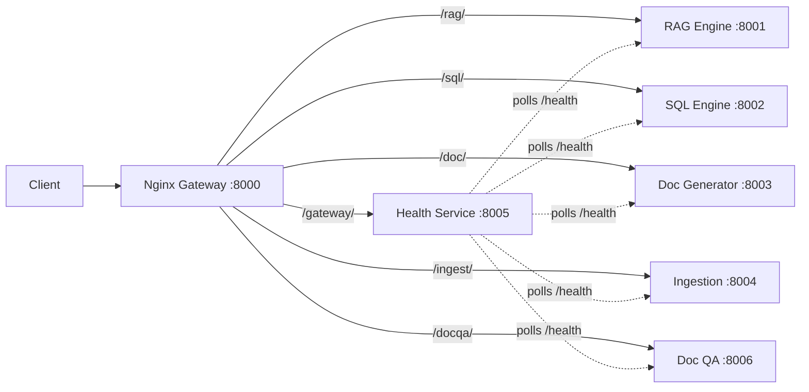

# Agentic Gateway

[](https://nginx.org/)
[](https://www.python.org/)
[](https://fastapi.tiangolo.com/)
[](https://systemd.io/)
[](https://www.gnu.org/software/bash/)
[](LICENSE)

Production API gateway with Nginx reverse proxy, health aggregation service, systemd process management, SSL/TLS support (self-signed + Let's Encrypt), and deployment automation scripts for multi-agent AI platforms.

---

## Architecture



All client traffic enters through a single Nginx reverse proxy on **port 8000**. Each agent runs as an isolated process on its own port. The health service continuously polls every agent and exposes a unified status dashboard.

---

## Features

- **Nginx reverse proxy** on port 8000 routing to 6 backend agents
- **URL prefix stripping** (e.g., `/rag/query` -> agent receives `/query`)
- **SSE/streaming support** with `proxy_buffering off`
- **Health aggregation service** polling all agent `/health` endpoints
- **6 systemd service files** with crash recovery (`RestartSec=5s`, burst protection)
- **SSL/TLS**: self-signed (testing) -> Let's Encrypt (production)
- **11 deployment/management scripts** for full lifecycle automation
- **50 MB upload limit**, 120s read timeout

---

## Tech Stack

| Component | Technology |
|-----------|-----------|
| Reverse Proxy | Nginx |
| Health Service | FastAPI (Python) |
| Process Manager | systemd |
| SSL/TLS | OpenSSL / Let's Encrypt (certbot) |
| Scripting | Bash |

---

## Quick Start

```bash
git clone https://github.com/AniruddhaPKawarase/agentic-gateway.git
cd agentic-gateway

# Install Nginx and copy config
sudo cp nginx/vcs-agents.conf /etc/nginx/sites-available/
sudo ln -s /etc/nginx/sites-available/vcs-agents.conf /etc/nginx/sites-enabled/
sudo nginx -t && sudo systemctl reload nginx

# Install systemd services
sudo cp services/*.service /etc/systemd/system/
sudo systemctl daemon-reload

# Or use the install script:
sudo bash scripts/install.sh
```

---

## Nginx Configuration

The main config file is `nginx/vcs-agents.conf`. Key design decisions:

- **Upstream blocks** define each backend agent with its port, enabling load balancing if needed in the future.
- **Prefix stripping** uses `rewrite ^/rag/(.*) /$1 break;` so agents never see the gateway prefix.
- **SSE/streaming** is supported via `proxy_buffering off;`, `proxy_http_version 1.1;`, and appropriate `Connection` headers on streaming locations.
- **Timeouts** are set to `proxy_read_timeout 120s;` and `client_max_body_size 50M` to handle long-running LLM calls and file uploads.
- Additional SSL-ready configs (`vcs-agents-ssl.conf`, `vcs-agents-letsencrypt.conf`, `vcs-agents-live.conf`) are provided for staged TLS rollout.

---

## Systemd Services

| Service | Port | Route Prefix | Agent |
|---------|------|-------------|-------|
| `rag-agent.service` | 8001 | `/rag/` | RAG Engine |
| `sql-agent.service` | 8002 | `/sql/` | SQL Engine |
| `construction-agent.service` | 8003 | `/construction/` | Doc Generator |
| `ingestion-api.service` | 8004 | `/ingestion/` | Ingestion Pipeline |
| `gateway-service.service` | 8005 | `/gateway/` | Health Aggregator |
| `docqa-agent.service` | 8006 | `/docqa/` | Document QA |

All services are configured with `Restart=on-failure`, `RestartSec=5`, and `StartLimitBurst` to prevent restart storms.

---

## Scripts Reference

| Script | Description |
|--------|-------------|
| `install.sh` | Initial gateway setup |
| `deploy.sh` | Full deployment orchestration |
| `start-all.sh` | Start all agent services |
| `stop-all.sh` | Stop all agent services |
| `restart-agent.sh` | Restart a single agent |
| `status.sh` | Check all agent statuses |
| `logs.sh` | Tail agent logs (journalctl) |
| `add-agent.sh` | Add new agent to Nginx + systemd |
| `setup-ssl-selfsigned.sh` | Generate self-signed certs |
| `setup-ssl-letsencrypt.sh` | Setup Let's Encrypt |
| `renew-ssl.sh` | Certificate renewal |

---

## Health API

The health aggregation service runs on port 8005 (routed via `/gateway/`).

| Method | Endpoint | Description |
|--------|----------|-------------|
| `GET` | `/` | System overview |
| `GET` | `/health` | All agents health summary |
| `GET` | `/agents` | Detailed agent registry + status |
| `GET` | `/info` | System info (uptime, version) |

---

## SSL/TLS Setup

The gateway supports a staged TLS rollout:

1. **Self-signed (testing)** -- Generate certs for local/staging verification:
   ```bash
   sudo bash scripts/setup-ssl-selfsigned.sh
   ```
2. **Let's Encrypt (production)** -- Obtain trusted certificates via certbot:
   ```bash
   sudo bash scripts/setup-ssl-letsencrypt.sh
   ```
3. **Auto-renewal** -- Certbot timer handles renewal; manual trigger if needed:
   ```bash
   sudo bash scripts/renew-ssl.sh
   ```

Switch between HTTP and HTTPS configs by symlinking the appropriate Nginx config in `sites-enabled/`.

---

## Project Structure

```
agentic-gateway/
├── nginx/
│   ├── vcs-agents.conf              # Main HTTP config
│   ├── vcs-agents-ssl.conf          # Self-signed SSL config
│   ├── vcs-agents-letsencrypt.conf  # Let's Encrypt config
│   └── vcs-agents-live.conf         # Production live config
├── services/
│   ├── rag-agent.service
│   ├── sql-agent.service
│   ├── construction-agent.service
│   ├── ingestion-api.service
│   ├── gateway-service.service
│   └── docqa-agent.service
├── scripts/
│   ├── install.sh
│   ├── deploy.sh
│   ├── start-all.sh
│   ├── stop-all.sh
│   ├── restart-agent.sh
│   ├── status.sh
│   ├── logs.sh
│   ├── add-agent.sh
│   ├── setup-ssl-selfsigned.sh
│   ├── setup-ssl-letsencrypt.sh
│   └── renew-ssl.sh
├── health_service/
│   ├── main.py
│   ├── requirements.txt
│   └── .env.example
├── .gitignore
├── LICENSE
└── README.md
```

---

## Contributing

Contributions are welcome. Please open an issue first to discuss proposed changes.

1. Fork the repository
2. Create a feature branch (`git checkout -b feature/my-feature`)
3. Commit your changes (`git commit -m 'Add my feature'`)
4. Push to the branch (`git push origin feature/my-feature`)
5. Open a Pull Request

---

## License

This project is licensed under the MIT License. See [LICENSE](LICENSE) for details.
